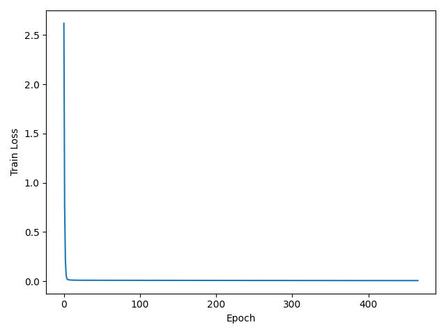
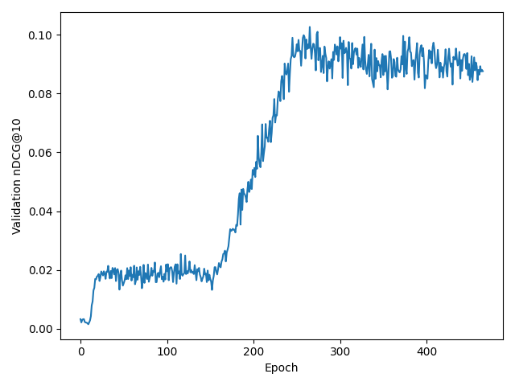
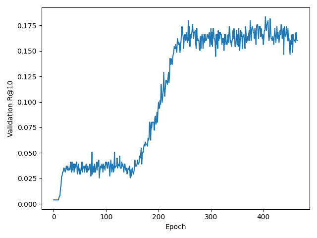
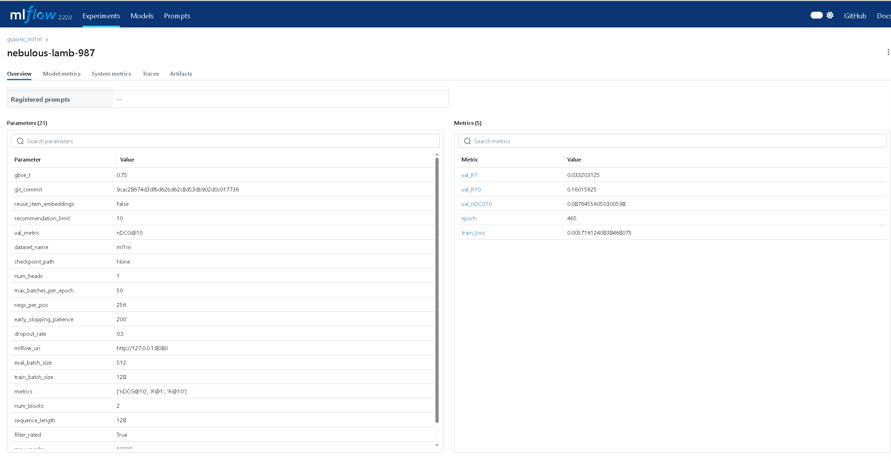

# gSASRec-pytorch

## О проекте

Данный репозиторий содержит порт модели **gSASRec** на PyTorch. Модель описана в статье RecSys '23 **“gSASRec: Reducing Overconfidence in Sequential Recommendation Trained with Negative Sampling”** авторов Александра Петрова и Крейга Макдональда (Университет Глазго), ссылка на статью: https://arxiv.org/pdf/2308.07192.pdf.

gSASRec основана на архитектуре **SASRec** и предназначена для последовательных рекомендаций. Основные отличия:
- Использование **большее число негативных примеров** на каждый положительный (параметр _k_).
- Функция потерь **gBCE (generalized Binary Cross-Entropy)** с параметром калибровки _t_, что позволяет уменьшить «чрезмерную уверенность» модели в скрытых предпочтениях пользователей.

Архитектура gSASRec идентична SASRec (трансформер-декодер), отличия заключаются только в процессе обучения и функции потерь. Для работы с гSASRec требуется предварительно обработанный датасет MovieLens-1M, который уже включен в репозиторий (обрезка менее популярных элементов, разбиение на тренировочную, валидационную и тестовую выборки).

Источник обработанного датасета: https://raw.githubusercontent.com/asash/ml1m-sas-mapping/main/ml-1m_sas.txt

## Установка и настройка окружения

1. **Клонирование репозитория**  
   ```bash
   git clone git@github.com:dorner333/ml1m-gSASRec.git
   cd ml1m-gSASRec
   ```

2. **Установка зависимостей через Poetry**  
   Убедитесь, что на компьютере установлен иначе установите её [Poetry](https://python-poetry.org/).  
   ```bash
   pip install poetry 
   ```

   Далее, если необходимо, удалите существующий `poetry.lock`
   ```bash
   rm poetry.lock
   ```

   И выполните установку зависимостей
   ```bash
   poetry install
   ```

   В некоторых образах torch ставится через poetry с ошибкой, тогда:
      И выполните установку зависимостей
   ```bash
   pip install torch
   ```

3. **Получение данных через DVC**  
   Для работы dvc нужно вставить пароль в файл .dvc/config.local !!!  
   Данные хранятся в удалённом хранилище, управление которым осуществляется с помощью DVC:
   ```bash
   dvc pull
   ```
   После выполнения команда загрузит необходимые файлы датасета MovieLens-1M, а также уже предобученные модели в формате .pt и .onnx
   Если у вас нет доступа к dvc, то датасет можно скачать с помощью команды:
   ```bash
   python scripts/preprocess_ml1m.py
   ```

4. **Проверка хуков pre-commit**  
   Перед коммитами в репозиторий рекомендуется запускать проверки:
   ```bash
   pre-commit install
   pre-commit run -a
   ```

После завершения этих шагов ваше окружение будет готово к дальнейшей разработке, обучению и инференсу модели.

## Обучение модели

Для запуска обучения используется скрипт `scripts/train_gsasrec.py`

Гиперпараметры лежат в `configs/model.yaml`


**Пример команды для обучения:**
Перед началом обучения должен быть поднят mlflow server
```bash
mlflow server \
  --backend-store-uri ./mlruns \
  --default-artifact-root ./mlruns \
  --host 127.0.0.1 \
  --port 8080
```

Запуск обучения:
```bash
python scripts/train_gsasrec.py
```

также можно изменить гиперпараметры через CLI hydra

```bash
python scripts/train_gsasrec.py negs_per_pos=128
```

В процессе обучения метрики (Recall@1, Recall@10, NDCG@10) будут логироваться в MLflow. По завершении обучения чекпоинт модели будет сохранён в папке `models/`.

Также в папке `plots/` хранится несколько графиков процесса обучения (например, график изменения функции потерь и метрик качества).





Процесс обучения логируется на mlflow



## Подготовка к продакшн-использованию

После успешного обучения полученный чекпоинт (`.pt`) можно конвертировать в формат ONNX для последующего быстрого инференса на различных платформах. Для этого используется скрипт `scripts/convert_to_onnx.py`.

**Пример команды для конвертации модели в ONNX:**
```bash
python scripts/convert_to_onnx.py  \
         --checkpoint_path models/gsasrec-ml1m-step:41904-t:0.75-negs:256-emb:128-dropout:0.5-metric:0.17770024210615018.pt \
         --output_path models/gsasrec-ml1m-step:41904-t:0.75-negs:256-emb:128-dropout:0.5-metric:0.17770024210615018.onnx
```

В результате вы получите файл ONNX-формата в папке `models/`. Для работы инференса на минимальном количестве зависимостей достаточно использовать этот ONNX-файл и скрипт `scripts/evaluate_gsasrec.py`, который поддерживает загрузку ONNX-модели.

### Необходимые артефакты для запуска в продакшне
- Файл модели в формате ONNX: `models/имя_модели.onnx`
- Скрипт для инференса: `scripts/evaluate_gsasrec.py`
- Файлы словаря и метаданные: `datasets/` 

## Инференс

После конвертации в ONNX вы можете запустить инференс на новых данных (например, сформировать рекомендации для реального пользователя). Для этого используется скрипт `scripts/evaluate_gsasrec.py`.

**Пример команды для инференса с ONNX-моделью:**
```bash
python scripts/evaluate_gsasrec.py \
    checkpoint_path=models/gsasrec-ml1m-step:41904-t:0.75-negs:256-emb:128-dropout:0.5-metric:0.17770024210615018.onnx
```

или можно использовать чекпоинт в формате `.pt`

```bash
python scripts/evaluate_gsasrec.py \
    checkpoint_path=models/gsasrec-ml1m-step:41904-t:0.75-negs:256-emb:128-dropout:0.5-metric:0.17770024210615018.pt
```

- **Результат работы:**  
  После выполнения скрипт выведет метрики качества (Recall и NDCG) на отложенной выборке. Также можете вызвать метод `get_predictions` внутри кода для построения списка рекомендаций для конкретного пользователя.

## MLflow Serving

Можно запустить модель на inference-сервер через MLflow и протестировать её:

0. Выберите модель, которую хотите запустить на сервере и добавте её в `model_artifact`:
```bash
cp models/gsasrec-ml1m-step:12768-t:0.75-negs:256-emb:128-dropout:0.5-metric:0.10273330724332005.pt model_artifact/model.pt
```

1. Зарегистрируйте модель:
```bash
export MLFLOW_TRACKING_URI=file://$(pwd)/mlruns
python scripts/mlflow_register.py
# В выводе появится: RUN_ID= <ВАШ_RUN_ID>
```

2. Запустите MLflow Serving на каком-нибудь порту:
```bash
mlflow models serve \
  -m mlruns/0/<ВАШ_RUN_ID>/artifacts/gsasrec_model \
  -h 0.0.0.0 \
  -p 5001 \
  --no-conda
```

3. Сделайте запрос к серверу:
```bash
curl -X POST -H "Content-Type: application/json" -d '{"dataframe_records":[{"instances":[1,34,56,23,0,0,0,0,0,0]}]}' http://127.0.0.1:5001/invocations
```

Получаем ответ в виде предсказанных айтемов:
```bash
   {"predictions": [[68, 710, 52, 997, 111, 102, 735, 639, 105, 662]]}
```


## Контакты и справка

Если возникают вопросы по коду или результатам, обратитесь ко мне:

- Ломакин Федор (lomakin.fv@phystech.edu)  

Полезные ссылки:
- Оригинальная репозиторий SASRec: https://github.com/kang205/SASRec  
- Репозиторий gSASRec на TensorFlow: https://github.com/asash/gsasrec  
- Статья gSASRec: https://arxiv.org/pdf/2308.07192.pdf
